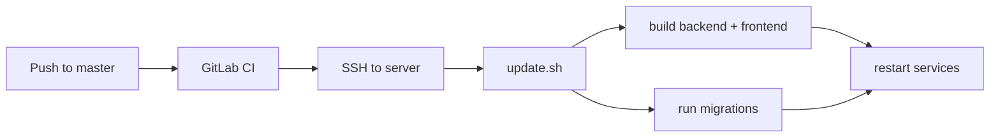

# langgraph-harness

> Not affiliated with LangChain. See [DISCLAIMER.md](DISCLAIMER.md).

The engineering context platform for GitLab. langgraph-harness reviews merge requests, resolves issues autonomously, and chats with full project context — remembering what matters so every run builds on the last.

Reviews fire on webhook events. A LangGraph agent with GitLab MCP tooling does the work. A React UI lets you watch live runs and dig through history.

## Stack

- **Frontend** — React admin UI (Dashboard, Threads, Chat, Workflows) for monitoring threads and run events, and chatting directly with the agent outside a merge request
- **Backend** — Elysia API server running a LangGraph agent with persistent checkpoints
- **Agent** — Multi-provider LLM (OpenRouter, Ollama, or sglang) with GitLab tools and skill-based workflows
- **Queue** — BullMQ runs initial reviews immediately; re-reviews debounce for 5 minutes (collapsing rapid pushes) unless the queue is free, in which case they start immediately. Concurrency is capped at 4 simultaneous reviews. The UI shows live queue state — active, debouncing, and waiting reviews — with a countdown on debouncing threads. A run that hasn't finished after 10 minutes is aborted automatically.
- **Memory** — the agent flags durable, project-specific facts as it reviews (conventions, recurring false positives, team preferences, decisions); a curator pass dedups and stores them per project, seeding future reviews of the same project. Chat has its own personal memories, saved and recalled directly by the model as durable facts about the user across conversations.

## Prerequisites

- Node.js 22+
- Docker (for PostgreSQL, Redis, and Lightpanda)
- A GitLab personal access token with `api` scope
- A GitLab OAuth application (for sign-in) — client ID and secret
- OpenRouter API key **or** a local Ollama/sglang instance

## Quick Start

**1. Install dependencies**

```bash
npm install
```

**2. Configure backend**

```bash
cp backend/.env.example backend/.env
# fill in GITLAB_PAT, GITLAB_OAUTH_CLIENT_ID/SECRET, SESSION_SECRET, SECRETS_ENCRYPTION_KEY, ADMIN_GITLAB_USERNAMES,
# and one of OPENROUTER_API_KEY, OLLAMA_BASE_URL, or SGLANG_BASE_URL
```

**3. Run**

```bash
npm run dev   # starts infra, runs migrations, and starts the dev server
```

Frontend opens at `http://localhost:5173`, API at `http://localhost:3698`.

See [`backend/README.md`](backend/README.md) for architecture diagrams, API docs, agent internals, webhook setup, and environment variable reference.

## CI/CD

Deployment is automated via GitLab CI on every push to `master`. The pipeline SSH-deploys to the production server and runs `update.sh` to rebuild and restart services. See [`docs/deployment.md`](docs/deployment.md) for the server-side setup — accounts, the SSH forced-command mechanism, directory layout, and what `update.sh` does.



**Required CI/CD variables** (Settings → CI/CD → Variables):

| Variable          | Type     | Description                                              |
| ----------------- | -------- | -------------------------------------------------------- |
| `SSH_PRIVATE_KEY` | Variable | Private key for the deploy user (no passphrase)          |
| `SSH_KNOWN_HOSTS` | Variable | Output of `ssh-keyscan <SSH_HOST>` — set once per server |
| `SSH_HOST`        | Variable | Hostname or IP of the production server                  |
| `SSH_USER`        | Variable | SSH username on the production server                    |

---

"LangGraph" is a trademark of LangChain, Inc., used here under nominative fair use to describe the framework this project is built on. This project is independent and not affiliated with LangChain, Inc. — see [DISCLAIMER.md](DISCLAIMER.md). Licensed under the [MIT License](LICENSE).
