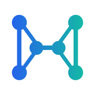
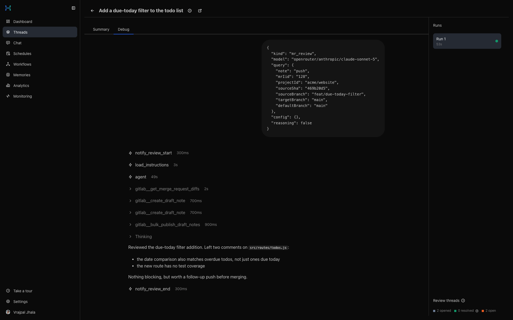

<div align="center">



# langgraph-harness

**The engineering context platform for GitLab**

Reviews merge requests, resolves issues autonomously, and chats with full project context — remembering what matters so every run builds on the last.

[](LICENSE)
[](package.json)
[](https://vrajpal-jhala.github.io/langgraph-harness/)

[Docs](https://vrajpal-jhala.github.io/langgraph-harness/) · [Getting Started](https://vrajpal-jhala.github.io/langgraph-harness/guide/getting-started) · [Features](https://vrajpal-jhala.github.io/langgraph-harness/features) · [Screenshots](https://vrajpal-jhala.github.io/langgraph-harness/screenshots)

</div>

> Not affiliated with LangChain. See [DISCLAIMER.md](DISCLAIMER.md).

---

## What it does

Four harnesses, one shared foundation:

- 🔍 **MR Review** — fires on webhook events, reads the diff, drafts comments, publishes them. No polling, no manual trigger.
- 🛠️ **Issue Resolution** — assign an issue and get a sandboxed agent that opens a draft MR and keeps responding to follow-up comments on the same branch.
- 💬 **Chat** — an interactive, GitLab-aware assistant with real tool access: GitLab data, a headless browser, its own review/chat history.
- 🛡️ **Guardrails & quality control** — every drafted comment is screened before it posts; a run that misbehaves (repeats a call, ends on a question, skips a check) gets caught and corrected mid-run, not after the fact.

Full breakdown: [Features](https://vrajpal-jhala.github.io/langgraph-harness/features) · [Architecture](https://vrajpal-jhala.github.io/langgraph-harness/architecture)

## Screenshots

<div align="center">

</div>

More in the [screenshots gallery](https://vrajpal-jhala.github.io/langgraph-harness/screenshots).

## Stack

- **Frontend** — React admin UI (Dashboard, Threads, Chat, Workflows) for monitoring runs and chatting directly with the agent
- **Backend** — Elysia API server running a LangGraph agent with persistent checkpoints
- **Agent** — Multi-provider LLM (OpenRouter, Ollama, or sglang) with GitLab MCP tools and skill-based workflows
- **Queue** — BullMQ; debounced re-reviews, capped concurrency, live queue state in the UI
- **Memory** — durable, project-scoped facts learned across reviews; personal memory in Chat

## Quick Start

**Prerequisites:** Node.js 22+, Docker, a GitLab PAT (`api` scope), a GitLab OAuth app, and an OpenRouter key or a local Ollama/sglang instance.

```bash
npm install
cp backend/.env.example backend/.env
# fill in GITLAB_PAT, GITLAB_OAUTH_CLIENT_ID/SECRET, SESSION_SECRET, SECRETS_ENCRYPTION_KEY,
# ADMIN_GITLAB_USERNAMES, and one of OPENROUTER_API_KEY / OLLAMA_BASE_URL / SGLANG_BASE_URL
npm run dev
```

Frontend at `http://localhost:5173`, API at `http://localhost:3698`.

Full walkthrough — GitLab OAuth app setup, webhook config, per-repo `.harness.yml`: [Getting Started](https://vrajpal-jhala.github.io/langgraph-harness/guide/getting-started).

## Deployment & CI/CD

Self-hosted via Docker Compose; production deploys are automated through GitLab CI on push. See [Deployment](https://vrajpal-jhala.github.io/langgraph-harness/deployment) for server setup, and [sglang Deployment](https://vrajpal-jhala.github.io/langgraph-harness/sglang-deployment) if self-hosting the LLM backend.

## The Story

Curious how this got built? [The Story So Far](https://vrajpal-jhala.github.io/langgraph-harness/journey).

---

"LangGraph" is a trademark of LangChain, Inc., used here under nominative fair use to describe the framework this project is built on. This project is independent and not affiliated with LangChain, Inc. — see [DISCLAIMER.md](DISCLAIMER.md). Licensed under the [MIT License](LICENSE).
