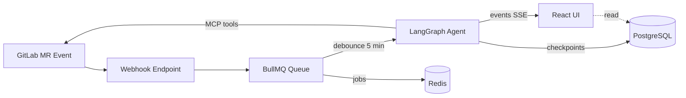
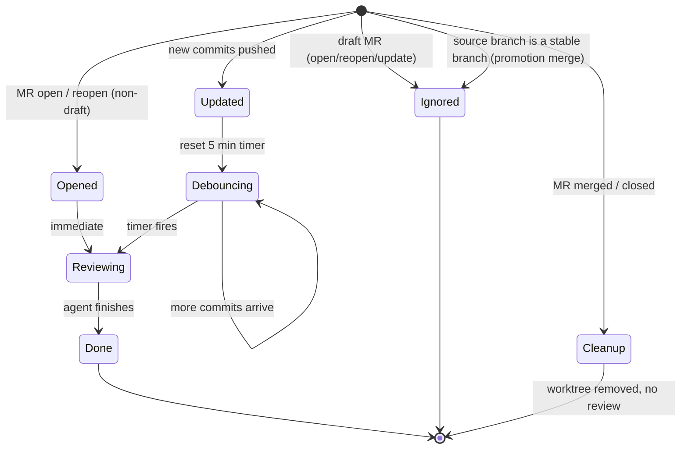
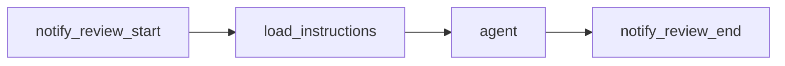

# langgraph-harness Backend

Elysia API server powering the langgraph-harness agent. Runs LangGraph workflows with GitLab MCP tools, persists conversation threads in PostgreSQL, and streams run events over SSE. MR reviews are triggered automatically via GitLab webhooks and debounced through a BullMQ queue; Chat runs are started directly by the user and can pause mid-run for tool-call approval.

## Architecture



## Setup

**1. Install dependencies**

```bash
npm install
```

**2. Configure environment**

```bash
cp .env.example .env
```

| Variable                        | Required       | Default                     | Description                                                                                                                                                            |
| ------------------------------- | -------------- | --------------------------- | ---------------------------------------------------------------------------------------------------------------------------------------------------------------------- |
| `GITLAB_PAT`                    | Yes            | —                           | GitLab personal access token (`api` scope)                                                                                                                             |
| `WEBHOOK_TOKENS`                | Yes            | —                           | Secret(s) for validating incoming GitLab webhook requests; comma-separated for multiple webhooks                                                                       |
| `GITLAB_OAUTH_CLIENT_ID`        | Yes            | —                           | GitLab OAuth application client ID, for login                                                                                                                          |
| `GITLAB_OAUTH_CLIENT_SECRET`    | Yes            | —                           | GitLab OAuth application client secret, for login                                                                                                                      |
| `SESSION_SECRET`                | Yes            | —                           | Signing secret for session cookies; also the key better-auth encrypts stored GitLab OAuth tokens with — rotating it forces every user to reconnect GitLab              |
| `SECRETS_ENCRYPTION_KEY`        | Yes            | —                           | Key for encrypting app-managed secrets at rest (e.g. per-user OpenRouter keys) — kept separate from `SESSION_SECRET` so rotating one doesn't break the other           |
| `ADMIN_GITLAB_USERNAMES`        | Yes            | —                           | Comma-separated GitLab @handles allowed to perform destructive actions                                                                                                 |
| `AUTH_TRUSTED_ORIGINS`          | No             | —                           | Comma-separated additional origins allowed as post-login redirect targets and OAuth hosts (e.g. a LAN IP) — each must also be a registered GitLab OAuth redirect URI   |
| `GITLAB_API_URL`                | No             | `https://gitlab.com/api/v4` | GitLab API base URL (override for self-hosted)                                                                                                                         |
| `GITLAB_BOT_USERNAME`           | No             | —                           | Username of the GitLab account `GITLAB_PAT` belongs to — lets analytics tell the bot's own review comments apart from a human's when computing comment acceptance rate |
| `GITLAB_BOT_NAME`               | No             | `langgraph-harness`         | Git commit author name used for commits the bot makes                                                                                                                  |
| `GITLAB_BOT_EMAIL`              | No             | `bot@example.com`           | Git commit author email used for commits the bot makes                                                                                                                 |
| `WORKFLOW_PROJECT_PATH_FILTERS` | No             | —                           | Comma-separated GitLab project-path substrings to restrict MR review/work-item workflows to. Empty means no restriction — every project is in scope                    |
| `AUTH_ALLOWED_EMAIL_DOMAINS`    | No             | —                           | Comma-separated email domains allowed to sign in via GitLab OAuth. Empty means no restriction                                                                          |
| `ISSUE_TRACKER_URL`             | No             | this repo's GitHub issues   | Link shown in the "file an issue" footer on AI-authored MR/thread notes                                                                                                |
| `OPENROUTER_API_KEY`            | One of         | —                           | For cloud LLMs (GPT, Claude) in MR review. Chat instead uses each user's own key, saved (encrypted) from the Settings page — this env var doesn't cover it.            |
| `OLLAMA_BASE_URL`               | One of         | `http://localhost:11434`    | For local LLMs                                                                                                                                                         |
| `OLLAMA_API_KEY`                | No             | —                           | Bearer token sent to Ollama, for authenticated/hosted Ollama endpoints                                                                                                 |
| `SGLANG_BASE_URL`               | One of         | `http://localhost:30000`    | For local LLMs served via sglang                                                                                                                                       |
| `SGLANG_API_KEY`                | No             | —                           | Bearer token sent to sglang, for authenticated/hosted sglang endpoints                                                                                                 |
| `DB_HOST`                       | No             | `localhost`                 | PostgreSQL host                                                                                                                                                        |
| `DB_PORT`                       | No             | `5432`                      | PostgreSQL port                                                                                                                                                        |
| `DB_USER`                       | No             | `postgres`                  | PostgreSQL user                                                                                                                                                        |
| `DB_PASSWORD`                   | No             | `postgres`                  | PostgreSQL password                                                                                                                                                    |
| `DB_NAME`                       | No             | `harness`                   | PostgreSQL database name                                                                                                                                               |
| `REDIS_URL`                     | No             | `redis://localhost:6379`    | Redis connection URL (used by both ioredis and BullMQ)                                                                                                                 |
| `LIGHTPANDA_CDP_URL`            | No             | `http://localhost:9222`     | CDP endpoint for the Lightpanda headless browser, used by chat's `fetch_web_page` tool                                                                                 |
| `SUPERMEMORY_URL`               | No             | `http://localhost:6767`     | URL of the self-hosted supermemory server, used by chat's `list_projects`/`search_project_history`/`get_project_issue` tools                                           |
| `SUPERMEMORY_API_KEY`           | For chat tools | —                           | Supermemory API key. Ingested projects themselves are configured in `utils/config.ts`'s `supermemoryProjects`, not via env vars                                        |
| `MONITORING_URL`                | No             | `http://localhost:4100`     | URL of the standalone monitoring service backing the admin-only `/monitoring` page                                                                                     |
| `MONITORING_API_KEY`            | For monitoring | —                           | Shared key presented to the monitoring service on every request; must match its own `MONITORING_API_KEY`                                                               |
| `LOG_LEVEL`                     | No             | `info`                      | Log verbosity: `debug`, `info`, `warn`, `error`                                                                                                                        |

**3. Run database migrations**

```bash
npm run migrate
```

## Scripts

| Script                 | Description                           |
| ---------------------- | ------------------------------------- |
| `npm run dev`          | Start dev server with hot reload      |
| `npm run build`        | Compile TypeScript to `./build`       |
| `npm run preview`      | Run compiled build in production mode |
| `npm run migrate`      | Apply all pending database migrations |
| `npm run migrate:down` | Roll back the last migration          |

## API

| Method   | Path                                    | Description                                                                                 |
| -------- | --------------------------------------- | ------------------------------------------------------------------------------------------- |
| `GET`    | `/api/models`                           | List available LLM models                                                                   |
| `GET`    | `/api/threads`                          | List threads (paginated, filterable — see below)                                            |
| `POST`   | `/api/threads`                          | Create a thread                                                                             |
| `GET`    | `/api/threads/projects`                 | List distinct project names seen across threads                                             |
| `GET`    | `/api/threads/:id`                      | Get a single thread with its latest run status                                              |
| `GET`    | `/api/threads/:id/runs`                 | List runs for a thread                                                                      |
| `POST`   | `/api/threads/:id/runs`                 | Create and start a run (immediate-start workflows only, e.g. Chat)                          |
| `GET`    | `/api/threads/:id/runs/:runId`          | Get a single run                                                                            |
| `POST`   | `/api/threads/:id/runs/:runId/retry`    | Retry a run from a checkpoint                                                               |
| `POST`   | `/api/threads/:id/runs/:runId/decision` | Approve or reject a tool call an interruptible run is paused on                             |
| `GET`    | `/api/threads/:id/runs/:runId/stream`   | SSE stream of run events                                                                    |
| `POST`   | `/api/threads/:id/runs/:runId/abort`    | Abort a running run                                                                         |
| `GET`    | `/api/workflows`                        | List workflows with live status and run stats                                               |
| `GET`    | `/api/workflows/:id`                    | Get a single workflow's status and stats                                                    |
| `GET`    | `/api/workflows/:id/graph`              | Get the workflow's compiled LangGraph as Mermaid syntax                                     |
| `GET`    | `/api/analytics/overview`               | Reliability/efficiency/guardrail KPIs for one workflow kind, optionally since a date        |
| `GET`    | `/api/analytics/by-repo`                | Per-repo review run/failure breakdown, paginated, optionally filtered to one project        |
| `GET`    | `/api/analytics/usage`                  | Usage totals: users, threads by kind, memories by scope                                     |
| `GET`    | `/api/analytics/trend`                  | Daily duration/volume/success-rate trend for one workflow kind, optionally since a date     |
| `GET`    | `/api/users`                            | Active and total user counts                                                                |
| `GET`    | `/api/monitoring/stack-containers`      | Admin-only: compose-stack container CPU/memory stats                                        |
| `GET`    | `/api/monitoring/sandbox-fleet`         | Admin-only: sandbox fleet CPU/memory/reachability stats                                     |
| `GET`    | `/api/monitoring/disk-usage`            | Admin-only: disk usage per data directory                                                   |
| `GET`    | `/api/memories`                         | List a project's memories, or your own with scope=personal, optionally filtered by category |
| `GET`    | `/api/memories/projects`                | List projects with a memory count each                                                      |
| `GET`    | `/api/memories/personal`                | Your own personal memory count                                                              |
| `DELETE` | `/api/memories/:id`                     | Delete a memory (admin: any; otherwise: your own personal memory only)                      |
| `POST`   | `/api/uploads`                          | Upload a file (chat image attachment), returns a servable ref                               |
| `GET`    | `/api/uploads/:filename`                | Serve a previously uploaded file                                                            |
| `POST`   | `/webhooks/gitlab`                      | Receive GitLab MR webhook events                                                            |

**List threads** (`GET /api/threads`) accepts `projects` (repeated), `statuses` (repeated), `title`, `limit` (default 25, max 100), and `offset` query params, and returns `{ data, total }`.

**Run input** (`POST /api/threads/:id/runs`) — MR review threads are only ever started via the GitLab webhook; this route is for Chat:

```json
{
  "message": "What changed in my-group/my-project since last week?",
  "images": ["/api/uploads/<hash>.png"],
  "model": "qwen3.6:latest",
  "reasoning": false,
  "tools": { "server": true, "gitlab": true }
}
```

**Retry run input** (`POST /api/threads/:id/runs/:runId/retry`):

```json
{
  "checkpointId": "<checkpoint-id>"
}
```

Spawns a new run resuming the workflow from the given checkpoint. `checkpointId` is optional — omit it (or send an empty body) to retry a failed run that has no checkpoint to resume from.

**Decision input** (`POST /api/threads/:id/runs/:runId/decision`), for a Chat run paused awaiting tool-call approval:

```json
{
  "toolCallId": "<tool-call-id>",
  "decision": "approve"
}
```

## Automated Reviews

Reviews are triggered automatically by GitLab MR webhook events — no manual `/review` command needed.

**Configure a GitLab webhook** pointing to `POST /webhooks/gitlab` with the **Merge request events** trigger enabled.

- **URL**: `https://<your-host>/webhooks/gitlab`
- **Trigger**: Merge request events



| Event                             | Action                                                                                                              | Behaviour                                  |
| --------------------------------- | ------------------------------------------------------------------------------------------------------------------- | ------------------------------------------ |
| MR opened/reopened (non-draft)    | `open` / `reopen`                                                                                                   | Starts an initial review immediately       |
| MR opened/reopened as draft       | `open` / `reopen` + `draft: true`                                                                                   | Ignored                                    |
| Draft MR marked ready             | `update` + `changes.draft` goes `true` → `false`                                                                    | Starts an initial review immediately       |
| New commits pushed                | `update` + `oldrev` present                                                                                         | Resets the debounce timer (5 min)          |
| Promotion between stable branches | source branch matches the stable-branch pattern (`dev`, `stag(e/ing)`, `master`, `main`, optionally suffixed `-vN`) | Skipped automatically                      |
| All other updates                 | `update` without `oldrev` or a draft transition                                                                     | Ignored                                    |
| MR merged/closed                  | `merge` / `close`                                                                                                   | Cleans up the MR's git worktree; no review |

Incoming webhooks are filtered by project path (`mrReview.projectPathFilters` in `config.ts`, matched by substring). Requests from projects that don't match are silently ignored. A repo's `.harness.yml` can further exclude branches (see [Repository Configuration](#repository-configuration) below). The worker processes up to `mrReview.concurrency` (default: 4) reviews concurrently.

A review thread untouched for `mrReview.archivalRetentionMs` (default: 30 days) is archived automatically: its checkpoint state is purged to bound storage growth, but the thread and its run history remain — only retrying it is blocked. A new push to the same MR still starts a fresh review as normal. Chat threads are archived the same way after `chat.retentionMs` of inactivity.

## Automated Work Item Resolution

Work-item-resolve is triggered by assigning the bot to a GitLab Issue or Task — no manual command needed.

**Configure a GitLab webhook** pointing to `POST /webhooks/gitlab` with the **Issue events**, **Comment events**, and **Work item events** triggers enabled. Issue events cover classic Issues; Work item events cover Tasks (GitLab's newer issue type — Epics, Incidents, and other non-Task work item types are ignored). Comment events let a tagged reply on the resulting MR re-trigger a run.

- **URL**: `https://<your-host>/webhooks/gitlab`
- **Triggers**: Issue events, Comment events, Work item events

| Event                                       | Behaviour                                             |
| ------------------------------------------- | ----------------------------------------------------- |
| Issue/Task assigned to the bot              | Starts a run                                          |
| Issue/Task opened/reopened already assigned | Starts a run                                          |
| Issue/Task unassigned from the bot          | Ignored                                               |
| Issue/Task closed, no MR ever opened        | Cleans up the issue's git worktree; no run            |
| Issue/Task closed, MR already exists        | Ignored — the MR's own merge/close event owns cleanup |
| Human comment tagging the bot on the MR     | Starts a fresh run against the issue's current state  |
| The bot's own status comment on the MR      | Ignored — never mistaken for reviewer feedback        |

Incoming webhooks are filtered by project path (`workItemResolve.projectPathFilters` in `config.ts`, matched by substring, shared with MR review). A thread stops accepting new runs once it hits `workItemResolve.runCap` (default: 10).

> **Sandbox network egress isn't enforced.** `Sandbox.create()` doesn't pass a `networkPolicy` — confirmed non-functional under this deployment's Docker backend (`opensandbox/sandbox.toml`'s `docker_runtime = "kata"`), not just untested. OpenSandbox's egress sidecar only intercepts a sandbox's traffic if both containers share one Kata guest VM, which requires Kubernetes' `RuntimeClass`-driven pod-sandbox grouping (a CRI-level mechanism); the Docker backend has no equivalent, so the sidecar and sandbox end up as two independent Kata VMs and the sidecar's policy never sees real sandbox traffic (see `docs/deployment.md#opensandbox`). `allowedEgressDomains` (`commonEgressDomains`/`PROJECT_EGRESS_DOMAINS`) has been removed entirely — the agent receives no network domain guidance at all. Lateral movement is still out of scope regardless: sandboxes run on Kata's own per-sandbox networking, routed through a dedicated `docker-kata` daemon and bridge (`172.20.0.0/16`), a separate daemon and network entirely from the compose stack's `harness_default` (`172.18.0.0/16`) where `docker-socket-proxy-kata`/`postgres`/`redis`/`backend` live — no route between them, so any exposure is bounded to arbitrary internet egress, not access to the rest of the infrastructure.

## Repository Configuration

A repository can opt into per-repo review behavior with a `.harness.yml` file at its **root on the default branch**. It's resolved once per review from the default branch; the MR's own branch cannot override it. Everything is optional — a missing, invalid, or unsupported-version file just means the MR is reviewed with defaults. A ready-to-copy example lives at [`docs/harness-config/v1.example.yml`](../docs/harness-config/v1.example.yml).

```yaml
# .harness.yml
version: 1

# Instruction docs fed to the reviewer. Each entry has a `path` (read from the
# default branch). Add `match` globs to attach a doc only when the MR changes a
# matching file; omit `match` to always attach it.
mr_review_instructions:
  - path: docs/review-guidelines.md # always attached
  - path: docs/typescript.md
    match: ['**/*.ts', '**/*.tsx'] # only when the MR touches TS files

# Same shape as above, fed to the work-item-resolve agent instead.
work_item_resolve_instructions:
  - path: docs/issue-resolution-guidelines.md

# Skip review when the source or target branch matches a glob.
exclude_branches:
  source: ['release/*', 'wip/**']
  target: ['staging']

# Only review an MR once the bot is one of its reviewers; default false reviews as today.
mr_review_requires_harness_reviewer: false
```

| Key                                      | Type     | Default | Description                                                                                                                    |
| ---------------------------------------- | -------- | ------- | ------------------------------------------------------------------------------------------------------------------------------ |
| `version`                                | number   | `1`     | Config schema version. Only `1` is supported; other values skip instructions.                                                  |
| `mr_review_instructions[].path`          | string   | —       | Repo-relative path to an instruction doc, read from the default branch. Missing docs are skipped with a warning.               |
| `mr_review_instructions[].match`         | string[] | —       | Globs; the doc is attached only when the MR changes a matching file. Omit to always attach.                                    |
| `work_item_resolve_instructions[].path`  | string   | —       | Same as `mr_review_instructions[].path`, fed to the work-item-resolve agent instead.                                           |
| `work_item_resolve_instructions[].match` | string[] | —       | Same as `mr_review_instructions[].match`, fed to the work-item-resolve agent instead.                                          |
| `exclude_branches.source`                | string[] | `[]`    | Branch-name globs; an MR whose **source** branch matches is not reviewed.                                                      |
| `exclude_branches.target`                | string[] | `[]`    | Branch-name globs; an MR whose **target** branch matches is not reviewed.                                                      |
| `mr_review_requires_harness_reviewer`    | boolean  | `false` | Only review an MR once the bot's username is one of its reviewers. A reviewer change that adds the bot also triggers a review. |

Branch and file patterns are matched with [micromatch](https://github.com/micromatch/micromatch): `*` matches within one path segment, `**` across segments. If the MR's changed-file list can't be fetched, all instruction docs are attached (fail-open).

> **Migrating an existing `.harness.yml`:** the `instructions` key was renamed to `mr_review_instructions` — repos still using the old name will have those instructions silently stop applying.

**Instruction size cap** — the concatenated instruction block is capped at 32,000 characters (a rough token-budget proxy) and truncated with a notice when exceeded. Instructions are injected inside a `<repository_instructions>` block so the model treats them as review guidance, not as overrides to its core behavior. The `load_instructions` node also updates the review comment to note whether instructions were applied, missing, or failed to load.

> **Work Item Resolve sandbox languages:** the sandbox image is chosen by detecting `package.json`, `pyproject.toml`/`requirements.txt`, or `go.mod` at the repo root (Node.js, Python, or Go). A repo using another language/runtime (Rust, .NET, Java, Ruby, PHP, etc.) has no fallback image and fails at sandbox creation.

## Agent

The agent is built on LangGraph with checkpoint persistence (PostgreSQL). Each run streams events over SSE, including `message`, `tool_input`, `tool_output`, `node_start`, `node_end`, and `checkpoint`, plus narrower events for specific middleware (`model_retry`, `context_usage`, `summarize_context_start`/`end`, `comment_critic_start`/`end` (mr-review), `reply_critic_start`/`end` (work-item-resolve), `corrective_nudge_start`/`end`, `extract_project_memory_start`/`end`, `queue_wait`, `llm_backend_wait_start`/`end`, `agent_prompt`, `subagent_error`). `GET /api/workflows/:id/graph` returns the graph below as Mermaid, generated live from the compiled LangGraph rather than hand-maintained.

`checkpoint` events carry an `id` that can be passed to the retry endpoint to resume the workflow from that point.



- `notify_review_start` — posts a "Review in progress..." comment on the MR via GitLab API
- `load_instructions` — resolves `.harness.yml` instruction docs (see [Repository Configuration](#repository-configuration)) before the agent starts
- `agent` — runs the full review using GitLab MCP tools with an internal todo list (`todoListMiddleware`); the MR's branch is checked out into a local git worktree so the agent can diff, read, and grep the repo directly instead of relying solely on the GitLab API
- `notify_review_end` — updates the comment to "Review completed."

Failure handling isn't a graph node — it's a `try`/`catch` around the whole workflow run in the runs service. If the run throws, is aborted, or exceeds its 10-minute timeout, the service updates the MR comment to "Review failed.", "Review aborted.", or "Review timed out." accordingly, directly via the GitLab API, outside the LangGraph flow above.

A run's `started_at` and `completed_at` are maintained entirely by database triggers (set on the `queued` → `running` transition and on the transition into a terminal status, respectively) rather than by application code, and duration is always computed from that pair — this keeps it consistent, non-negative, and unaffected by unrelated later writes such as archiving. A thread's `updated_at` is touched the same way by any insert/update/delete of its runs, except archiving, which explicitly skips it so it doesn't misrepresent the thread's last real activity.

Before publishing, draft review comments pass through a **comment critic** middleware: an LLM judges each draft and silently withholds low-value ones (hedged non-issues, diff restatements, unsupported speculation, style opinions dressed up as bugs, stale "still not addressed" reposts), while keeping comments that describe genuine new progress or flag out-of-scope changes. The critic retries a failed screening attempt before giving up, and publishes the batch unscreened rather than withholding everything if it still can't produce a verdict.

If a run finishes without calling a single tool, it's nudged once to actually check the merge request's current state (new commits, diff, open discussions) before concluding — this catches a re-review that would otherwise just restate a previous run's summary as if nothing needed a fresh look.

**Tool output cap** — every tool result is capped at 40,000 characters (a rough token-budget proxy, same trade-off as the instruction size cap above); an oversized result is truncated with a notice rather than passed through whole. This is a safety backstop, not a per-tool convention to remember — it applies uniformly regardless of which tool ran, since a single unbounded result can outsize the summarizer's own keep budget and survive a context reset unshrunk.

**Sub-agent review** — the agent can call `spawn_subagent` to hand one file's diff to an isolated verifier agent (its own read/grep/list tools, no MCP), keeping that investigation out of the main agent's own context. A sub-agent's activity streams under the same run, tagged with the spawning tool call's id (`subagentId`) so its own `agent_prompt`, `message`, and `tool_input`/`tool_output` events can be filtered into a dedicated view. A guardrail abort or stuck-generation loop detected inside one sub-agent's own stream fails only that `spawn_subagent` call (returned as a normal tool error) — it doesn't cancel the run or any other concurrently-running sub-agent.

Skills in `src/skills/` provide step-by-step workflow instructions loaded at runtime via the `load_skill` tool:

- `gitlab-mcp/code-review` — initial review and re-review workflows, draft note pattern, approval step
- `gitlab-mcp/merge-requests` — general MR interaction patterns

## Project Memory

The agent builds durable, project-specific memory over time instead of starting every review from scratch. Mid-review, it can call `create_memory_candidate` to flag a fact worth remembering — a convention, a recurring false positive, a team preference, an architectural decision; if a run ends with nothing flagged, it's nudged once to reconsider before finishing.

After the run, a **memory curator** pass reviews every candidate against the project's existing memories (and against each other, to catch the same fact flagged under two categories) and decides, per candidate, to add, update, retire, or skip it — only keeping facts phrasable as a check or rule a future review could act on. The curator has its own retry on a malformed response, independent of the agent's own retry handling.

Memories are stored in the `memories` table (categories: knowledge, preference, lesson, decision), scoped to either a project or a user — never both. Project memories are loaded back as context to seed every future review of that project. See `GET /api/memories` and `GET /api/memories/projects` in the API table above. A user can also remove a single memory directly via `DELETE /api/memories/:id`, gated by the same confirm-password check as other destructive endpoints.

## Personal Memory

Chat has its own memory, separate from the project-memory curator pipeline above. Instead of flagging candidates for a later reconciliation pass, the model writes directly: `create_personal_memory` to save a new fact, `query_personal_memories` to check for one first, `update_personal_memory` to revise one in place rather than duplicate it, and `delete_personal_memory` to remove one the user says is stale or wrong. There's no curator for personal memories — avoiding duplicates and retiring stale ones is the model's own responsibility, encouraged by the tool descriptions and the chat system prompt.

Personal memories share the same `memories` table and categories as project memories, scoped by user instead of project (`GET /api/memories?scope=personal`). A user can delete their own personal memory without needing an admin — `DELETE /api/memories/:id` allows it when the row's `user_id` matches the caller, independent of the admin-only path project memories still require.

## LLM Providers

| Provider       | Models                                                               | Config               |
| -------------- | -------------------------------------------------------------------- | -------------------- |
| OpenRouter     | Gemini 2.5 Flash Lite, GPT 5 Mini, Claude Haiku 4.5, Claude Sonnet 5 | `OPENROUTER_API_KEY` |
| sglang (local) | Qwen 3.6 35B AWQ (default), Qwen 3.8 27B FP8, Qwen 3.6 27B AWQ       | `SGLANG_BASE_URL`    |
| Ollama (local) | Qwen 3.6 35B, Qwen 3.6 27B, Qwen 3.5 9B, Gemma 4 31B                 | `OLLAMA_BASE_URL`    |

The self-hosted backends (sglang, Ollama) cap concurrent in-flight calls (`provider.concurrency` in `config.ts`) since, unlike OpenRouter, they run on fixed local hardware — a call that arrives once the cap is hit queues behind a `p-limit` limiter instead of being sent immediately. Queued calls emit `llm_backend_wait_start`/`end` (see [Agent](#agent) above), and average wait time is tracked per-day in the analytics trend endpoint.
