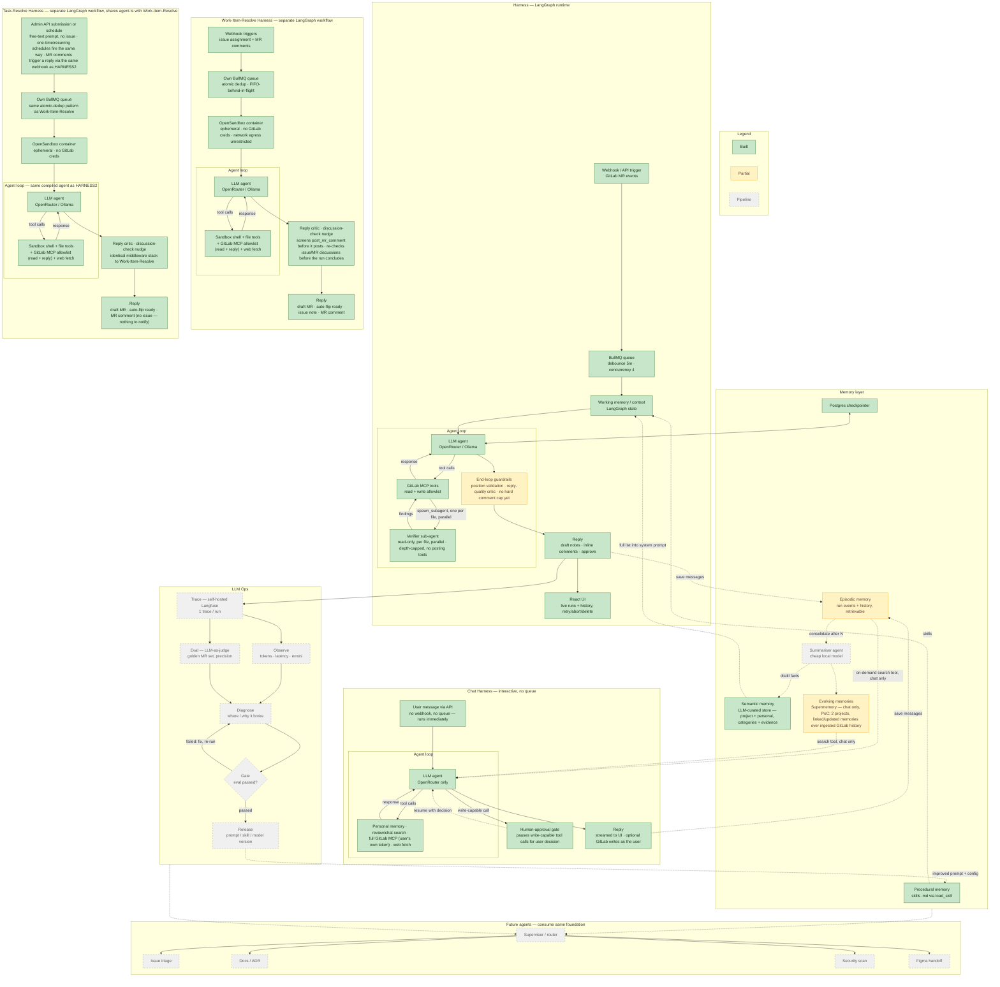

# langgraph-harness — Target System Architecture

Layered view of langgraph-harness: the LangGraph **Harness/Loop**, the **Memory layer**, and **LLM Ops**, plus future agents that consume the same foundation.

Four harnesses exist side by side, not one plugging into another: **MR Review** (below, webhook on MR events → debounced queue → agent loop over GitLab MCP tools → draft-note/comment reply), **Work Item Resolve** (webhook on issue assignment + MR comments → its own FIFO queue → agent loop inside an ephemeral sandboxed container → draft MR / MR reply), **Task Resolve** (admin submits a free-text prompt via the API, or schedules one to fire once or on a recurring cadence — no issue, no assignment webhook — which opens its own draft MR directly; MR comments on it trigger a reply run through the same webhook path Work Item Resolve uses → draft MR / MR reply), and **Chat** (user message via API, no webhook and no queue at all — runs immediately — agent loop with a human-approval gate on write-capable tool calls → reply streamed to the UI). They share the Postgres checkpointer, the project/personal-memory store, and the React UI/analytics (which also carries retry/abort/delete actions, not just viewing) — but each harness's tool surface is structurally different (MR Review: GitLab MCP tools against a bare worktree, no sandbox; Issue Resolve and Task Resolve: sandbox shell + file access, a read+reply GitLab MCP allowlist (bot token), and a web-fetch tool (headless browser + Readability, SSRF-guarded); Chat: the user's own GitLab token against the full MCP toolset, plus personal-memory and its own web-fetch tools), so none of them is a variant of another's loop — though Issue Resolve and Task Resolve go further and share the exact same compiled agent (`agent.ts`: same middleware stack, same tool set), differing only in what triggers a run and what supplies the task.

**Status legend**

- 🟩 **Built** — present in the codebase today
- 🟨 **Partial** — foundations exist, not yet complete
- ⬜ **Pipeline** — planned, not yet built (dashed)

## Status breakdown

### 🟩 Built — MR Review harness

- Webhook trigger, BullMQ queue (debounce + concurrency), LangGraph workflow + working state
- Agent loop (`createAgent`, `todoListMiddleware`), GitLab MCP tool allowlist, tool-call loop
- `spawn_subagent` delegates per-file diff verification to an isolated read-only Verifier sub-agent (`read_text_file`/`git_grep`/`read_multiple_files`/`list_directory` only, no posting tools) — one spawn per file, dispatched in parallel in the same turn, depth-capped (no `spawn_subagent` of its own, so no further nesting); it returns findings only, the main agent stays the sole poster/writer
- Position validation before a draft note reaches GitLab, plus a reply-quality critic that screens every draft comment before publish, dropping hedged/praise-y non-issues — the one gap left in this pair is a hard numeric cap on comment count, which doesn't exist yet
- Reply path (draft notes, inline comments, approve/unapprove), Postgres checkpointer + retry
- Procedural memory (skills `.md` via `load_skill`), React UI with live SSE

### 🟩 Built — Work-Item-Resolve harness

- Webhook triggers (issue assigned to the bot, comments on its MR), own BullMQ queue — atomic dedup + FIFO-behind-in-flight, not the debounce-collapse the MR Review queue uses
- Ephemeral OpenSandbox container per run — shell + file tools, no GitLab credentials ever inside it, network egress unrestricted (OpenSandbox's egress sidecar needs Kata pod-sandbox grouping, which its Docker backend can't express — see `docs/deployment.md#opensandbox`)
- GitLab reads/replies go through the same shared GitLab MCP client MR Review uses (bot token), restricted to a narrow read+reply allowlist (`mr_discussions`, `list_issue_discussions`, `create_merge_request_discussion_note`) rather than the workflow's own bespoke REST calls
- Agent loop (`createAgent`) with a reply-quality critic screening every MR comment before it posts, dropping non-actionable filler, plus a discussion-check nudge that catches a run concluding without ever checking `list_issue_discussions`/`mr_discussions` — covers feedback that lands mid-run, not just what existed when the run started
- `fetch_web_page` (headless browser via Lightpanda + Readability extraction, SSRF-guarded via `ipaddr.js` unicast-allowlisting rather than a hand-rolled denylist) is now part of this sandbox's tool set, not just Chat's — shared with Task Resolve through the same `web-fetch.ts`
- Reply path (draft MR, auto-flip to ready once verification passes, GitLab issue-note lifecycle notifications)

### 🟩 Built — Task-Resolve harness

- No issue and no assignment webhook — an admin submits a free-text prompt plus a repo URL via `POST /api/task-resolve/` (`isAdmin`-gated), which resolves the repo and opens the draft MR directly on that first run
- Or the same prompt/repo pair is saved as a schedule (`schedules` component, `isAdmin`-gated) that fires later via BullMQ — one-time via a delayed job, recurring via a BullMQ job scheduler keyed to a cron pattern derived from the chosen cadence — each fire materializes a fresh Task-Resolve thread/run identical to a direct API submission; schedule-spawned threads are tagged and excluded from the general thread list, visible only under the schedule's own run history
- Follow-up MR comments reuse Work Item Resolve's existing note webhook path unchanged: a thread is matched by `{project, mrIid}`, not by workflow kind, so no separate trigger exists — the comment's text becomes the next run's prompt verbatim (`state.prompt`, last-write-wins, not re-read from an issue like Work Item Resolve does)
- Own BullMQ queue (`task-resolve`), same atomic-dedup-by-thread pattern as Work Item Resolve
- Runs on the exact same compiled agent as Work Item Resolve (`agent.ts`'s shared `buildAgent`/`agent.invoke`) — identical middleware stack (reply critic, discussion-check nudge, etc.) and identical sandbox tool surface, including `fetch_web_page`; the only per-workflow pieces are the system-prompt's intro line and identifiers block
- Reply path: draft MR, auto-flip to ready once verification passes, status posted as an MR note only — no issue note (there's no issue), and the MR description is kept static (just the prompt) rather than duplicating the note's status/summary text on the same page

### 🟩 Built — Chat harness

- No webhook, no queue — `startMode: 'immediate'`, runs synchronously when the user sends a message; `interruptible: true` so a paused run can resume later, not just abort
- Tool surface built fresh per run, scoped to the signed-in user: personal-memory CRUD, review/chat content + thread search always on; the full GitLab MCP toolset (not an allowlist, unlike MR Review) gated on the user's own OAuth token; web-page fetch (headless browser + Readability) gated behind a toggle
- Human-approval gate: any tool call the MCP server itself doesn't mark `readOnlyHint` pauses the run for the user to approve/decline before it executes — a real pause/resume via forking the LangGraph checkpoint, not a soft prompt instruction
- Reply streamed to the UI; GitLab writes only ever happen as the signed-in user's own token, never a shared bot credential

### 🟩 Built — shared across all four harnesses

- Semantic memory: an LLM-curated store (project-scoped and personal/chat-scoped), plain Postgres columns (`category`/`title`/`content`/`evidence`, no vector search), loaded in full into the system prompt rather than retrieved by similarity — browsable at `/memories`
- Postgres checkpointer + retry, React UI with live SSE + analytics (retry/abort/delete actions on top of live viewing, not read-only)

### 🟨 Partial

- **Episodic memory** — run events are persisted to Postgres and are retrievable via plain text/regex search (`search_review_content`/`search_chat_content`, chat-workflow tools only) — not yet semantic/RAG-based, and not yet consolidated into distilled facts (that's `SUM`'s still-unbuilt job)
- **Guardrails** — the remaining gap is narrower than it used to be: position validation and a reply-quality critic are both built (see above); a hard numeric comment cap is the one piece not yet built
- **Evolving memories (Supermemory)** — real and wired (self-hosted service, ingested via `scrape_issues.ts`, queried by chat's `search_project_history`/`get_project_issue`/`list_projects` tools), linking and updating memories rather than a static one-shot extraction — but the code's own comment calls it a PoC: hardcoded to 2 GitLab projects (`supermemoryProjects` in `config.ts`), chat-only, not available to MR Review, Work Item Resolve, or Task Resolve

### ⬜ Pipeline

- **Memory:** scaling evolving memories beyond the 2-project chat-only PoC to every project and all four harnesses; a summariser/consolidation loop distilling episodic run history into durable memories; vector-similarity retrieval over the memory store (today's full-list-into-prompt approach is the only retrieval mode); genuine multi-hop graph queries, if evolving memories' linking turns out not to be enough for that
- **LLM Ops:** self-hosted Langfuse tracing, observe, LLM-as-judge evals on a golden MR dataset, diagnose → gate → release loop with prompt/skill/model versioning
- **Multi-agent:** supervisor/router + future agents (triage, docs, security, Figma) as consumers of the shared memory + ops foundation

## Phasing note

- **Phase 1 (low-friction):** episodic memory (retrievable/consolidated, not just persisted) on **existing Postgres**; add Langfuse. Semantic memory (project + personal) is already built — no `pgvector` needed for it, contrary to this note's original premise. Scale evolving memories (Supermemory) past its 2-project chat-only PoC.
- **Phase 2 (only if evolving memories' linking isn't enough for genuine multi-hop/temporal reasoning):** add a dedicated graph store — Graphiti on **FalkorDB** (Redis module) or `graphiti-postgres`/Apache AGE — avoiding a Neo4j deployment.
